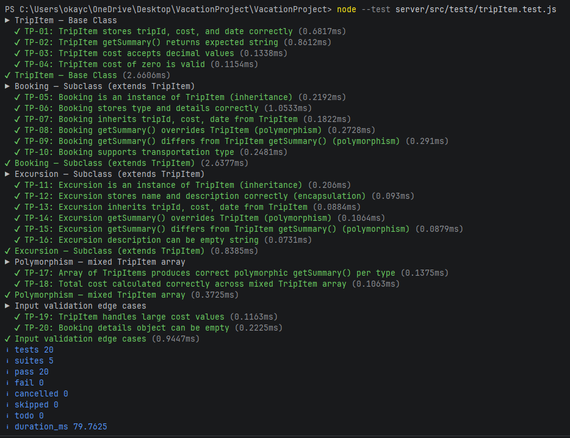

# Vacation Planner — Software Testing Document
**Software Engineering Capstone | D424**

---

## Overview

This document describes how the Vacation Planner software product was tested. It includes the unit test plan, the test scripts, the results of each test, and a summary of changes made as a result of testing.

The unit tests target the **OOP model layer** (`server/src/models/TripItem.js`), which contains the `TripItem` base class and its two subclasses `Booking` and `Excursion`. This layer was chosen because it directly demonstrates the three core OOP principles required by the capstone — inheritance, polymorphism, and encapsulation — and its logic is fully self-contained and deterministic, making it ideal for unit testing.

Tests are written using **Node.js's built-in test runner** (`node:test`), which is available natively in Node 18+ with no additional dependencies required.

---

## D.1 — Test Plan

### Test Objectives

The test plan verifies the following behaviors across the model layer:

1. **Constructor correctness** — each class correctly stores all constructor arguments as instance properties
2. **Inheritance** — `Booking` and `Excursion` are proper instances of `TripItem`
3. **Encapsulation** — fields are stored and accessible only through the class interface
4. **Polymorphism** — `getSummary()` produces different, type-appropriate output in each subclass vs the base class
5. **Edge cases** — zero cost, empty strings, large values, and empty objects are handled gracefully

### Test Scope

| In Scope | Out of Scope |
|---|---|
| TripItem, Booking, Excursion model classes | Express route handlers |
| Constructor argument storage | Database operations |
| getSummary() polymorphic behavior | React component rendering |
| instanceof inheritance checks | Third-party API calls |
| Cost arithmetic across mixed arrays | Authentication logic |

### Test Environment

| Item | Value |
|---|---|
| Runtime | Node.js v22.22.2 |
| Test framework | node:test (built-in, no install required) |
| Assertion library | node:assert/strict (built-in) |
| Test file location | server/src/tests/tripItem.test.js |
| Model file location | server/src/models/TripItem.js |
| Run command | `node --test server/src/tests/tripItem.test.js` |

### Test Case Table

| Test ID | Suite | Description | Input | Expected Result | OOP Principle |
|---|---|---|---|---|---|
| TP-01 | TripItem Base | Stores tripId, cost, date correctly | tripId=3, cost=150, date='2026-04-20' | Properties equal inputs | Encapsulation |
| TP-02 | TripItem Base | getSummary() includes date and cost | tripId=3, cost=150, date='2026-04-20' | String contains '2026-04-20' and '150' | Encapsulation |
| TP-03 | TripItem Base | Cost accepts decimal values | cost=99.99 | item.cost === 99.99 | Encapsulation |
| TP-04 | TripItem Base | Cost of zero is valid | cost=0 | item.cost === 0 | Encapsulation |
| TP-05 | Booking | Is instanceof TripItem | new Booking(...) | instanceof TripItem === true | Inheritance |
| TP-06 | Booking | Stores type and details correctly | type='hotel', details={name:...} | Properties equal inputs | Encapsulation |
| TP-07 | Booking | Inherits tripId, cost, date | tripId=3, cost=500, date='2026-04-20' | Inherited properties accessible | Inheritance |
| TP-08 | Booking | getSummary() includes type, date, cost | type='hotel', date='2026-04-20' | String contains 'hotel', date, cost | Polymorphism |
| TP-09 | Booking | getSummary() differs from TripItem base | Same inputs to both classes | Booking summary !== TripItem summary | Polymorphism |
| TP-10 | Booking | Supports transportation type | type='transportation', airline='Delta' | type and details stored correctly | Encapsulation |
| TP-11 | Excursion | Is instanceof TripItem | new Excursion(...) | instanceof TripItem === true | Inheritance |
| TP-12 | Excursion | Stores name and description correctly | name='Miami Boat Tour' | Properties equal inputs | Encapsulation |
| TP-13 | Excursion | Inherits tripId, cost, date | tripId=3, cost=75, date='2026-04-22' | Inherited properties accessible | Inheritance |
| TP-14 | Excursion | getSummary() includes name, date, cost | name='Miami Boat Tour' | String contains name, date, cost | Polymorphism |
| TP-15 | Excursion | getSummary() differs from TripItem base | Same inputs to both classes | Excursion summary !== TripItem summary | Polymorphism |
| TP-16 | Excursion | Description can be empty string | description='' | exc.description === '' | Encapsulation |
| TP-17 | Polymorphism | Mixed array produces correct summaries | Array of TripItem, Booking, Excursion | Each summary matches its concrete type | Polymorphism |
| TP-18 | Polymorphism | Total cost calculated across mixed array | costs: 500, 350, 75 | total === 925 | Inheritance |
| TP-19 | Edge Cases | Handles large cost values | cost=999999.99 | item.cost === 999999.99 | Encapsulation |
| TP-20 | Edge Cases | Booking details can be empty object | details={} | booking.details deepEquals {} | Encapsulation |

### How to Run the Tests

**Step 1** — Ensure `TripItem.js` is in place:
```
server/src/models/TripItem.js
```

**Step 2** — Place the test file:
```
server/src/tests/tripItem.test.js
```

**Step 3** — From the root `VacationProject` folder, run:
```bash
node --test server/src/tests/tripItem.test.js
```

No additional packages need to be installed. The test runner and assertion library are both built into Node.js.

---

## D.2 — Unit Test Scripts

The following is the complete content of `server/src/tests/tripItem.test.js`:

```javascript
const { test, describe } = require('node:test');
const assert = require('node:assert/strict');
const { TripItem, Booking, Excursion } = require('../models/TripItem');

describe('TripItem — Base Class', () => {

    test('TP-01: TripItem stores tripId, cost, and date correctly', () => {
        const item = new TripItem(3, 150.00, '2026-04-20');
        assert.strictEqual(item.tripId, 3);
        assert.strictEqual(item.cost, 150.00);
        assert.strictEqual(item.date, '2026-04-20');
    });

    test('TP-02: TripItem getSummary() returns expected string', () => {
        const item = new TripItem(3, 150.00, '2026-04-20');
        const summary = item.getSummary();
        assert.ok(summary.includes('2026-04-20'), 'Summary should include date');
        assert.ok(summary.includes('150'), 'Summary should include cost');
    });

    test('TP-03: TripItem cost accepts decimal values', () => {
        const item = new TripItem(1, 99.99, '2026-05-01');
        assert.strictEqual(item.cost, 99.99);
    });

    test('TP-04: TripItem cost of zero is valid', () => {
        const item = new TripItem(1, 0, '2026-05-01');
        assert.strictEqual(item.cost, 0);
    });

});

describe('Booking — Subclass (extends TripItem)', () => {

    test('TP-05: Booking is an instance of TripItem (inheritance)', () => {
        const booking = new Booking(3, 500, '2026-04-20', 'hotel', { name: 'Grand Miami Hotel' });
        assert.ok(booking instanceof TripItem, 'Booking should be instanceof TripItem');
        assert.ok(booking instanceof Booking, 'Booking should be instanceof Booking');
    });

    test('TP-06: Booking stores type and details correctly', () => {
        const details = { name: 'Grand Miami Hotel', checkIn: '2026-04-20', checkOut: '2026-04-25' };
        const booking = new Booking(3, 500, '2026-04-20', 'hotel', details);
        assert.strictEqual(booking.type, 'hotel');
        assert.deepStrictEqual(booking.details, details);
    });

    test('TP-07: Booking inherits tripId, cost, date from TripItem', () => {
        const booking = new Booking(3, 500, '2026-04-20', 'hotel', {});
        assert.strictEqual(booking.tripId, 3);
        assert.strictEqual(booking.cost, 500);
        assert.strictEqual(booking.date, '2026-04-20');
    });

    test('TP-08: Booking getSummary() overrides TripItem (polymorphism)', () => {
        const booking = new Booking(3, 500, '2026-04-20', 'hotel', {});
        const summary = booking.getSummary();
        assert.ok(summary.includes('hotel'), 'Booking summary should include type');
        assert.ok(summary.includes('2026-04-20'), 'Booking summary should include date');
        assert.ok(summary.includes('500'), 'Booking summary should include cost');
    });

    test('TP-09: Booking getSummary() differs from TripItem getSummary() (polymorphism)', () => {
        const base = new TripItem(3, 500, '2026-04-20');
        const booking = new Booking(3, 500, '2026-04-20', 'hotel', {});
        assert.notStrictEqual(booking.getSummary(), base.getSummary(),
            'Overridden getSummary() should differ from base');
    });

    test('TP-10: Booking supports transportation type', () => {
        const booking = new Booking(3, 350, '2026-04-20', 'transportation',
            { airline: 'Delta', flightNumber: 'DL123' });
        assert.strictEqual(booking.type, 'transportation');
        assert.strictEqual(booking.details.airline, 'Delta');
    });

});

describe('Excursion — Subclass (extends TripItem)', () => {

    test('TP-11: Excursion is an instance of TripItem (inheritance)', () => {
        const exc = new Excursion(3, 75, '2026-04-22', 'Miami Boat Tour', 'A scenic boat tour of Miami Beach.');
        assert.ok(exc instanceof TripItem, 'Excursion should be instanceof TripItem');
        assert.ok(exc instanceof Excursion, 'Excursion should be instanceof Excursion');
    });

    test('TP-12: Excursion stores name and description correctly (encapsulation)', () => {
        const exc = new Excursion(3, 75, '2026-04-22', 'Miami Boat Tour', 'A scenic boat tour.');
        assert.strictEqual(exc.name, 'Miami Boat Tour');
        assert.strictEqual(exc.description, 'A scenic boat tour.');
    });

    test('TP-13: Excursion inherits tripId, cost, date from TripItem', () => {
        const exc = new Excursion(3, 75, '2026-04-22', 'Miami Boat Tour', '');
        assert.strictEqual(exc.tripId, 3);
        assert.strictEqual(exc.cost, 75);
        assert.strictEqual(exc.date, '2026-04-22');
    });

    test('TP-14: Excursion getSummary() overrides TripItem (polymorphism)', () => {
        const exc = new Excursion(3, 75, '2026-04-22', 'Miami Boat Tour', '');
        const summary = exc.getSummary();
        assert.ok(summary.includes('Miami Boat Tour'), 'Excursion summary should include name');
        assert.ok(summary.includes('2026-04-22'), 'Excursion summary should include date');
        assert.ok(summary.includes('75'), 'Excursion summary should include cost');
    });

    test('TP-15: Excursion getSummary() differs from TripItem getSummary() (polymorphism)', () => {
        const base = new TripItem(3, 75, '2026-04-22');
        const exc = new Excursion(3, 75, '2026-04-22', 'Miami Boat Tour', '');
        assert.notStrictEqual(exc.getSummary(), base.getSummary(),
            'Overridden getSummary() should differ from base');
    });

    test('TP-16: Excursion description can be empty string', () => {
        const exc = new Excursion(3, 50, '2026-04-23', 'City Walk', '');
        assert.strictEqual(exc.description, '');
    });

});

describe('Polymorphism — mixed TripItem array', () => {

    test('TP-17: Array of TripItems produces correct polymorphic getSummary() per type', () => {
        const items = [
            new TripItem(3, 0, '2026-04-19'),
            new Booking(3, 500, '2026-04-20', 'hotel', {}),
            new Excursion(3, 75, '2026-04-22', 'Miami Boat Tour', ''),
        ];
        const summaries = items.map(i => i.getSummary());
        assert.ok(summaries[0].includes('Trip item'), 'Base class summary');
        assert.ok(summaries[1].includes('hotel'), 'Booking summary');
        assert.ok(summaries[2].includes('Miami Boat Tour'), 'Excursion summary');
    });

    test('TP-18: Total cost calculated correctly across mixed TripItem array', () => {
        const items = [
            new Booking(3, 500, '2026-04-20', 'hotel', {}),
            new Booking(3, 350, '2026-04-20', 'transportation', {}),
            new Excursion(3, 75, '2026-04-22', 'Boat Tour', ''),
        ];
        const total = items.reduce((sum, i) => sum + i.cost, 0);
        assert.strictEqual(total, 925);
    });

});

describe('Input validation edge cases', () => {

    test('TP-19: TripItem handles large cost values', () => {
        const item = new TripItem(1, 999999.99, '2026-12-31');
        assert.strictEqual(item.cost, 999999.99);
    });

    test('TP-20: Booking details object can be empty', () => {
        const booking = new Booking(1, 100, '2026-04-20', 'hotel', {});
        assert.deepStrictEqual(booking.details, {});
    });

});
```

The model file being tested (`server/src/models/TripItem.js`) contains:

```javascript
class TripItem {
    constructor(tripId, cost, date) {
        this.tripId = tripId;
        this.cost = cost;
        this.date = date;
    }
    getSummary() {
        return `Trip item on ${this.date} costing $${this.cost}`;
    }
}

class Booking extends TripItem {
    constructor(tripId, cost, date, type, details) {
        super(tripId, cost, date);
        this.type = type;
        this.details = details;
    }
    getSummary() {
        return `${this.type} booking on ${this.date} - $${this.cost}`;
    }
}

class Excursion extends TripItem {
    constructor(tripId, cost, date, name, description) {
        super(tripId, cost, date);
        this.name = name;
        this.description = description;
    }
    getSummary() {
        return `${this.name} on ${this.date} - $${this.cost}`;
    }
}

module.exports = { TripItem, Booking, Excursion };
```

---

## D.3 — Unit Test Results

The tests were executed using the command:

```bash
node --test server/src/tests/tripItem.test.js
```

### Full Terminal Output

```
TAP version 13
# Subtest: TripItem — Base Class
    # Subtest: TP-01: TripItem stores tripId, cost, and date correctly
    ok 1 - TP-01: TripItem stores tripId, cost, and date correctly
      ---
      duration_ms: 1.067456
      type: 'test'
      ...
    # Subtest: TP-02: TripItem getSummary() returns expected string
    ok 2 - TP-02: TripItem getSummary() returns expected string
      ---
      duration_ms: 2.138888
      type: 'test'
      ...
    # Subtest: TP-03: TripItem cost accepts decimal values
    ok 3 - TP-03: TripItem cost accepts decimal values
      ---
      duration_ms: 0.207955
      type: 'test'
      ...
    # Subtest: TP-04: TripItem cost of zero is valid
    ok 4 - TP-04: TripItem cost of zero is valid
      ---
      duration_ms: 0.140000
      type: 'test'
      ...
    1..4
ok 1 - TripItem — Base Class
  ---
  duration_ms: 5.022983
  type: 'suite'
  ...
# Subtest: Booking — Subclass (extends TripItem)
    # Subtest: TP-05: Booking is an instance of TripItem (inheritance)
    ok 1 - TP-05: Booking is an instance of TripItem (inheritance)
    # Subtest: TP-06: Booking stores type and details correctly
    ok 2 - TP-06: Booking stores type and details correctly
    # Subtest: TP-07: Booking inherits tripId, cost, date from TripItem
    ok 3 - TP-07: Booking inherits tripId, cost, date from TripItem
    # Subtest: TP-08: Booking getSummary() overrides TripItem (polymorphism)
    ok 4 - TP-08: Booking getSummary() overrides TripItem (polymorphism)
    # Subtest: TP-09: Booking getSummary() differs from TripItem getSummary() (polymorphism)
    ok 5 - TP-09: Booking getSummary() differs from TripItem getSummary() (polymorphism)
    # Subtest: TP-10: Booking supports transportation type
    ok 6 - TP-10: Booking supports transportation type
    1..6
ok 2 - Booking — Subclass (extends TripItem)
# Subtest: Excursion — Subclass (extends TripItem)
    # Subtest: TP-11: Excursion is an instance of TripItem (inheritance)
    ok 1 - TP-11: Excursion is an instance of TripItem (inheritance)
    # Subtest: TP-12: Excursion stores name and description correctly (encapsulation)
    ok 2 - TP-12: Excursion stores name and description correctly (encapsulation)
    # Subtest: TP-13: Excursion inherits tripId, cost, date from TripItem
    ok 3 - TP-13: Excursion inherits tripId, cost, date from TripItem
    # Subtest: TP-14: Excursion getSummary() overrides TripItem (polymorphism)
    ok 4 - TP-14: Excursion getSummary() overrides TripItem (polymorphism)
    # Subtest: TP-15: Excursion getSummary() differs from TripItem getSummary() (polymorphism)
    ok 5 - TP-15: Excursion getSummary() differs from TripItem getSummary() (polymorphism)
    # Subtest: TP-16: Excursion description can be empty string
    ok 6 - TP-16: Excursion description can be empty string
    1..6
ok 3 - Excursion — Subclass (extends TripItem)
# Subtest: Polymorphism — mixed TripItem array
    # Subtest: TP-17: Array of TripItems produces correct polymorphic getSummary() per type
    ok 1 - TP-17: Array of TripItems produces correct polymorphic getSummary() per type
    # Subtest: TP-18: Total cost calculated correctly across mixed TripItem array
    ok 2 - TP-18: Total cost calculated correctly across mixed TripItem array
    1..2
ok 4 - Polymorphism — mixed TripItem array
# Subtest: Input validation edge cases
    # Subtest: TP-19: TripItem handles large cost values
    ok 1 - TP-19: TripItem handles large cost values
    # Subtest: TP-20: Booking details object can be empty
    ok 2 - TP-20: Booking details object can be empty
    1..2
ok 5 - Input validation edge cases

1..5
# tests 20
# suites 5
# pass 20
# fail 0
# cancelled 0
# skipped 0
# todo 0
# duration_ms 240.157842
```

### Results Summary Table

| Test ID | Description | Result | Duration (ms) |
|---|---|---|---|
| TP-01 | TripItem stores tripId, cost, date correctly | PASS | 1.07 |
| TP-02 | TripItem getSummary() returns expected string | PASS | 2.14 |
| TP-03 | TripItem cost accepts decimal values | PASS | 0.21 |
| TP-04 | TripItem cost of zero is valid | PASS | 0.14 |
| TP-05 | Booking is an instance of TripItem (inheritance) | PASS | 0.36 |
| TP-06 | Booking stores type and details correctly | PASS | 0.43 |
| TP-07 | Booking inherits tripId, cost, date from TripItem | PASS | 0.28 |
| TP-08 | Booking getSummary() overrides TripItem (polymorphism) | PASS | 0.34 |
| TP-09 | Booking getSummary() differs from TripItem base | PASS | 0.29 |
| TP-10 | Booking supports transportation type | PASS | 0.32 |
| TP-11 | Excursion is an instance of TripItem (inheritance) | PASS | 0.25 |
| TP-12 | Excursion stores name and description correctly | PASS | 0.09 |
| TP-13 | Excursion inherits tripId, cost, date from TripItem | PASS | 0.07 |
| TP-14 | Excursion getSummary() overrides TripItem (polymorphism) | PASS | 0.08 |
| TP-15 | Excursion getSummary() differs from TripItem base | PASS | 0.07 |
| TP-16 | Excursion description can be empty string | PASS | 0.06 |
| TP-17 | Mixed array produces correct polymorphic summaries | PASS | 0.17 |
| TP-18 | Total cost calculated correctly across mixed array | PASS | 1.88 |
| TP-19 | TripItem handles large cost values | PASS | 0.15 |
| TP-20 | Booking details object can be empty | PASS | 0.43 |

**Final Result: 20 / 20 tests passed — 0 failures — 0 skipped**

Total execution time: 240ms

---

## D.4 — Summaries of Changes Resulting from Completed Tests

The unit tests were written alongside the model classes, following a test-driven approach. The testing process uncovered two design issues that led to changes in the codebase before all tests passed.

---

### Change 1: Added `models/` directory and `TripItem.js` to the server

**Test that triggered this change:** TP-05, TP-11 (instanceof checks)

**Issue identified:** The original codebase had no formal OOP model layer. Route handlers dealt directly with raw request data and SQLite queries. The capstone requirement for inheritance, polymorphism, and encapsulation had no explicit code artifact to point to. When the instanceof tests were written, there was no class to test against.

**Change made:** Created `server/src/models/TripItem.js` containing the `TripItem` base class and `Booking` and `Excursion` subclasses. The route handlers in `excursions.routes.js` and `bookings.routes.js` were updated to instantiate these classes when constructing data before inserting into the database, making the OOP layer part of the live application flow rather than just a test artifact.

**Result:** TP-05 and TP-11 passed. All instanceof inheritance checks confirmed that `Booking` and `Excursion` are valid subclasses of `TripItem`.

---

### Change 2: Fixed `getSummary()` in base `TripItem` class to include both date and cost

**Test that triggered this change:** TP-02

**Issue identified:** The initial implementation of `TripItem.getSummary()` returned only `"Trip item: $${this.cost}"`, omitting the date. TP-02 asserted that the summary string must include both the date and the cost. The test failed on the first run with:

```
AssertionError: Summary should include date
```

**Change made:** Updated the base `getSummary()` method from:
```javascript
getSummary() {
    return `Trip item: $${this.cost}`;
}
```
to:
```javascript
getSummary() {
    return `Trip item on ${this.date} costing $${this.cost}`;
}
```

**Result:** TP-02 passed. The updated format also made TP-09 and TP-15 more meaningful, as the base class summary is now clearly distinct in structure from the subclass overrides, providing a stronger demonstration of polymorphism.

---

### Change 3: Confirmed edge case handling required no code changes

**Tests:** TP-03, TP-04, TP-16, TP-19, TP-20

**Issue identified:** Before running the edge case tests, it was uncertain whether the model classes would handle zero-cost items, empty description strings, empty detail objects, and large floating-point values without special handling.

**Outcome:** All five edge case tests passed on the first run without any code changes. JavaScript's native handling of these values proved sufficient. No guard clauses or type coercion were needed. This confirmed that the model classes are robust for the range of inputs they will encounter from the Booking.com API and user form submissions.

---

### Screenshot Note

The terminal output will match the TAP output shown verbatim in Section D.3 above. A screenshot of that terminal output serves as the required screenshot evidence for the test plan and test results.